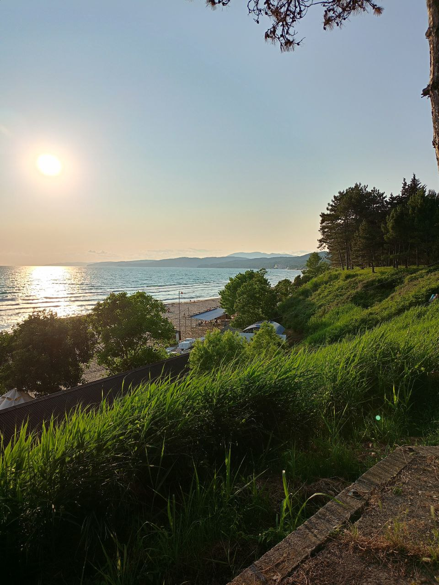
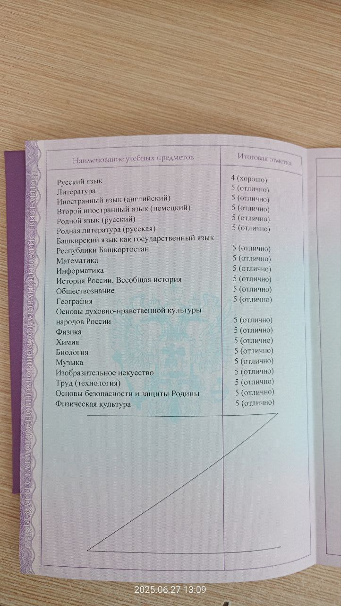

# ka319791.github.io
<!DOCTYPE html>
<html lang="ru">
<head>
    <meta charset="UTF-8">
    <meta name="viewport" content="width=device-width, initial-scale=1.0">
    <title>Обо мне</title>
    
</head>
<body>
    

        <header id="he">
            <h1>Я - Абдурахимов Кирилл</h1>
            <h2>Предоставляю свою личную(или не очень) информацию</h2>
        </header>
        
        

            

                

                    

                        

                            <h3>Откуда я:</h3>
                            <ul>
                                <li>Я живу в этом городе</li>
                                <li>Я пришел из 2-ой школы и поступил в данное учебное заведение</li>
                            </ul>
                        

                    

                    
                    

                        

                            <h3>Мои увлечения:</h3>
                            <ul>
                                <li>Химия</li>
                                <li>Математика</li>
                                <li>Программирование</li>
                            </ul>
                            
Естественно, эти знания на базовом уровне, ведь я слишком ленивый

                        

                    

                    
                    

                        

                            <h3>Чем бы я хотел заниматься, если бы не моя рассеянность:</h3>
                            <ul>
                                <li>Музыка, а точнее игра пианино/синтезаторе</li>
                                <li>Рисование(срисовывание по памяти). Я до этого рисовал всякий бессмысленный бред в стиле пиксель арт, но потом я понял, что этот навык не поможет хоть как-то в моей жизни</li>
                                <li>Английский язык. А я ведь ходил на кружок по нему где мы проходили материал 10-11 классов, но я все забыл</li>
                            </ul>
                        

                    

                

                
                

                    
←

                    
→

                

                
                

                    

                    

                    

                

                
                

                    Карточка 1 из 4
                

            

        

        
        

            

                
                
Это я на Черном море

            

            

                
                
Это мой аттестат

            

            

                
                
Это я на красной поляне

            

        

    
</body>
</html>
