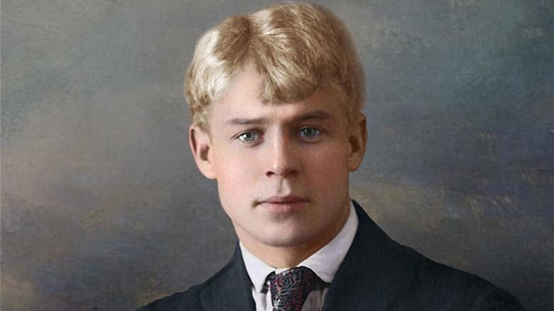
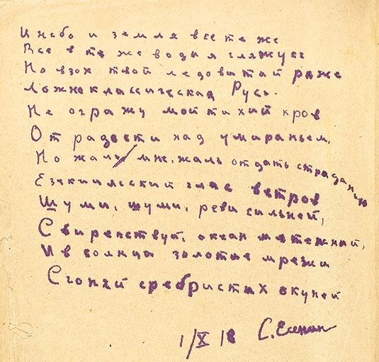
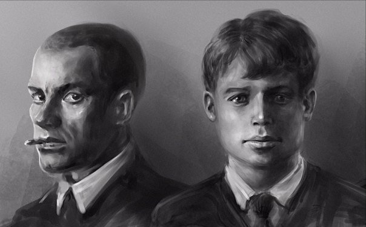

<html lang="ru">
<head>
    <meta charset="UTF-8">
    <meta name="viewport" content="width=device-width, initial-scale=1.0">
    <title>Есенин | Журнал о поэте</title>
    
</head>
<body>
    <!-- Шапка -->
    <header>
        

            <h1>СЕРГЕЙ ЕСЕНИН</h1>
            
Журнал о жизни и творчестве великого поэта

            <a href="#ai-video" class="watch-video-btn">Смотреть AI-видео с Есениным</a>
        

    </header>

    <!-- Навигация -->
    <nav>
        

            <a href="#biography" class="nav-item">Биография</a>
            <a href="#poetry" class="nav-item">Поэзия</a>
            <a href="#gallery" class="nav-item">Галерея</a>
            <a href="#facts" class="nav-item">Факты</a>
            <a href="#legacy" class="nav-item">Наследие</a>
        

    </nav>
    <!-- Секция с AI-видео -->
<section id="ai-video" class="video-section">
    

        

            <h2>Есенин читает свое стихотворение</h2>
            
Искусственный интеллект воссоздал голос и образ поэта. Послушайте, как мог бы звучать Есенин в XXI веке.

            
            <!-- ВСТАВЬ СЮДА СВОЁ ВИДЕО -->
            

                <video controls poster="es.png">
                    <source src="esv.mp4" type="video/mp4">
                    Ваш браузер не поддерживает видео тег.
                </video>
            

            
            

                <h3>«Осень»</h3>
                
Одно из самых лиричных и проникновенных стихотворений Есенина о природе, написанное в 1914 году. Поэт с удивительной точностью передаёт меланхоличное настроение осенней поры, сравнивая увядание природы с человеческими чувствами.

            

        

    

</section>
    <!-- Основной контент -->
    

        

            <!-- Основные статьи -->
            <main class="main-content">
                <article id="biography" class="article-card">
                    
                    

                        <h2>Жизнь и судьба: от рязанских полей до «Англетера»</h2>
        
Сергей Есенин родился 3 октября 1895 года в рязанском селе Константиново, в крестьянской семье. Детство, проведённое среди среднерусской природы, сформировало его поэтическое видение. «Как дерево роняет тихо листья, так я роняю грустные слова» — эти строки стали пророческими для его судьбы.

        
        
В 1912 году он уезжает в Москву, где работает в типографии, слушает лекции в народном университете и начинает активно писать. Уже через три года поступают первые признания — его стихи замечают Блок и Клюев.

        
        
Революцию 1917 года Есенин встречает с надеждой, видя в ней продолжение крестьянской утопии. Но очень скоро разочаровывается — вместо «мужицкого рая» приходит городская механизированная реальность. Этот конфликт между мечтой и действительностью станет главной драмой его жизни.

        
        
Последние годы — это бесконечные скитания по гостиницам, сложные отношения с женщинами (Айседора Дункан, Софья Толстая), борьба с алкоголизмом и нарастающее чувство одиночества. 28 декабря 1925 года его находят мёртвым в ленинградской гостинице «Англетер». До сих пор ведутся споры — было это самоубийство или убийство.
                        
                    

                </article>

                <article id="poetry" class="article-card">
                    
                    

                        <h2>«И зверьё, как братьев наших меньших»: Поэтическая вселенная Есенина</h2>
        
Поэтический стиль Есенина — это уникальный сплав народной образности, христианской символики и модернистских экспериментов. Его ранние стихи напоминают лубочные картинки — яркие, наивные, полные детской веры в мир:

        
        
<em>«Выткался на озере алый свет зари. На бору со звонами плачут глухари...»</em>

        
        
<strong>Ключевые черты его поэтики:</strong>

        <ul>
            <li><strong>Очеловечивание природы</strong> — берёзы «принакрылись снегом», клён «на одной ноге стоит»</li>
            <li><strong>Цветопись</strong> — преобладание алого, золотого, синего как отсылка к иконописи</li>
            <li><strong>Деревенский космос</strong> — противопоставление «естественного» села и «искусственного» города</li>
            <li><strong>Музыкальность</strong> — использование народных пеенных ритмов, частушечных размеров</li>
        </ul>
        
        
В поздний период его стиль становится трагическим, образы — более сложными и надрывными. Цикл «Москва кабацкая» и поэма «Чёрный человек» — это уже крик души, разрывающейся между светлой верой и тёмным отчаянием.
                    

                </article>

                <article id="gallery" class="article-card">
                    
                    

                        <h2>«Я последний поэт деревни»: Есенин в водовороте эпохи</h2>
        
Есенин стал голосом целого поколения, застигнутого на переломе эпох. Его судьба — это история о том, как Серебряный век столкнулся с советской реальностью.

        
        
<strong>В кругу современников:</strong> Он дружил с Николаем Клюевым, восхищался Блоком, соперничал с Маяковским, который называл его «златокудрым демоном». Его отношения с Айседорой Дункан стали символом встречи русской души и западного авангарда.

        
        
<strong>Революция:</strong> Сначала Есенин увидел в революции воплощение крестьянской мечты — он пишет поэмы «Преображение», «Инония» в духе христианского утопизма. Но очень скоро понимает, что новая власть несёт гибель его «стране березового ситца».

        
        
<strong>«Сорокоуст» и разочарование:</strong> Поэма «Сорокоуст» (1920) становится реквиемом по старой Руси. Знаменитые строки <em>«Вот он, вот он с железным брюхом...»</em> — это крик ужаса перед бездушным механическим прогрессом.

        
        
К середине 1920-х он чувствует себя чужим и в новой России, и в эмиграции. Его последнее большое стихотворение «Чёрный человек» — это исповедь человека, раздвоенного временем, поэта, пережившего свою эпоху.
                    

                </article>
            </main>

            <!-- Боковая панель -->
            <aside class="sidebar">
                

                    <h3>Избранное стихотворение</h3>
                    

                        «Не жалею, не зову, не плачу, 
                        Все пройдет, как с белых яблонь дым. 
                        Увяданья золотом охваченный, 
                        Я не буду больше молодым...»
                    

                

                

                    <h3>Малоизвестные факты</h3>
                    <ul class="facts-list">
                        <li>Первый сборник стихов «Радуница» вышел в 1916 году</li>
                        <li>Есенин был женат на Айседоре Дункан</li>
                        <li>Поэт много путешествовал по Европе и США</li>
                        <li>Обстоятельства его смерти до сих пор вызывают споры</li>
                        <li>В честь Есенина названы улицы по всей России</li>
                    </ul>
                

                

                    <h3>Наследие поэта</h3>
                    
Стихи Есенина переведены на десятки языков, его творчество изучают в школах и вузах по всему миру. Музеи поэта работают в Москве, Санкт-Петербурге и его родном Константиново.

                

            </aside>
        

    

    <!-- Подвал -->
    <footer>
        

            
Журнал о Сергее Есенине

            
Прикоснитесь к миру великого поэта

        

    </footer>
</body>
</html>
